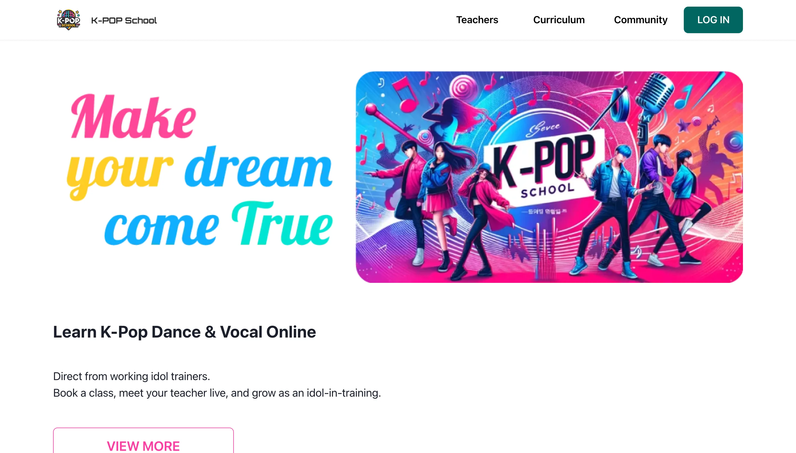
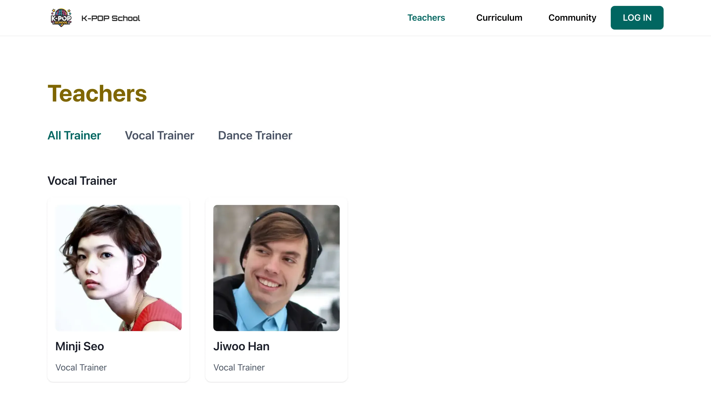
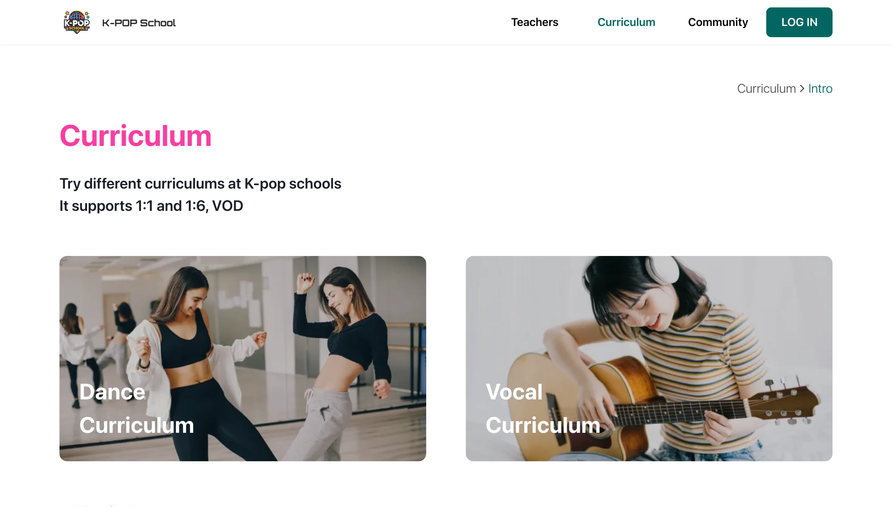

# K-POP School — 포트폴리오 데모

케이팝 댄스/보컬 레슨 예약 플랫폼을 처음부터 새로 만든 모던 스택 프로젝트입니다.
강사, 커리큘럼, 예약, 결제, 라이브 클래스, 퀴즈·수료증이 포함된 영상 레슨,
레슨별 토론, 리포팅 탭을 갖춘 관리자 대시보드까지 포함하며 —
안전하게 시연할 수 있는 포트폴리오용으로 제작되었습니다.

[](https://github.com/iamdeez/kpopschool-portfolio/actions/workflows/ci.yml)


**🔗 라이브 데모:** **https://kpopschool-portfolio-demo.netlify.app**
— **"Try the demo"** 버튼을 클릭하면 별도 설정 없이 로그인할 수 있고,
직접 계정을 만들어 가입할 수도 있습니다. 데모 로그인, 실제 회원가입/로그인,
관리자 로그인 모두 로컬이 아닌 이 실제 배포 환경에서 종단 간(End-to-End)으로
검증되었습니다.

<p>
  
</p>
<p float="left">
  
  
</p>

## 목차

- [리팩토링이 아닌 재작성을 선택한 이유](#리팩토링이-아닌-재작성을-선택한-이유)
- [아키텍처](#아키텍처)
- [시작하기](#시작하기)
- [테스트](#테스트)
- [배포](#배포)
- [숨기지 않고 공개하는 알려진 한계](#숨기지-않고-공개하는-알려진-한계)

전체 spec/plan/tasks 문서는 한 단계 위 경로에 있습니다 (이 저장소는 원본
`kpop_server`/`kpopschool`와 형제 관계이며, 공유 `docs/` 아래에 위치합니다):

- [`v1.0.0/001-kpopschool-portfolio-renewal/`](../docs/specs/v1.0.0/001-kpopschool-portfolio-renewal/spec.md) — 최초 재작성 ([설계 문서의 근거](../docs/specs/v1.0.0/001-kpopschool-portfolio-renewal/plan.md) 참고)
- [`v1.1.0/001-lesson-progress-tracking/`](../docs/specs/v1.1.0/001-lesson-progress-tracking/spec.md) — 레슨별 영상 구조 + 진도 추적
- [`v1.2.0/001-lesson-quiz-certificate/`](../docs/specs/v1.2.0/001-lesson-quiz-certificate/spec.md), [`002-admin-reporting-dashboard/`](../docs/specs/v1.2.0/002-admin-reporting-dashboard/spec.md), [`003-lesson-discussion-board/`](../docs/specs/v1.2.0/003-lesson-discussion-board/spec.md) — 퀴즈/수료증, 관리자 리포팅, 레슨별 토론 게시판

## 리팩토링이 아닌 재작성을 선택한 이유

이 프로젝트의 기반이 된 원본 저장소 두 개는 git 히스토리에 Firebase
서비스 계정 비공개 키가 커밋되어 있었고, 소스 코드에 Stripe 키와 Gmail
앱 비밀번호가 하드코딩되어 있었으며, `GET` 요청만으로 전체 데이터베이스를
삭제할 수 있는 인증되지 않은 엔드포인트가 있었고, 어떤 API 라우트에도
인증이 전혀 걸려 있지 않았습니다 (자세한 내용은
[`research.md`](../docs/specs/v1.0.0/001-kpopschool-portfolio-renewal/research.md) 참고;
*원본* 저장소에 대한 시정 조치 체크리스트는
[`SECURITY-ADVISORY.md`](../docs/specs/v1.0.0/001-kpopschool-portfolio-renewal/SECURITY-ADVISORY.md) 참고).
그 히스토리를 그대로 이어받는 대신, 깨끗한 git 히스토리와 전체 TypeScript
적용, 실질적인 인증/인가 레이어를 갖춘 새 코드베이스로 다시 만들었습니다.

## 아키텍처

```
apps/
├── web/      Vite + React 18 + TypeScript + Chakra UI (SPA)
└── server/   NestJS + TypeScript (Firestore 기반 REST API)
packages/
└── shared-types/   두 앱이 공유하는 도메인 타입
```

서버 측 도메인 모듈: `teacher`, `curriculum`(레슨 + 커리큘럼마다 선택적으로
포함되는 레슨별 퀴즈), `event`, `faq`, `review`, `inquiry`(1:1 비공개 문의),
`comment`(레슨별 공개 토론), `user`, `payment`(Stripe/mock 어댑터),
`video-class`(Zoom/mock 어댑터), `progress`(사용자별 레슨 완료, 퀴즈 채점,
수료증 자격 판정), `reporting`(관리자 전용 집계 통계), `demo`(마찰 없는
데모 로그인), `auth`.

**통합 어댑터 패턴** (핵심 설계 결정): Stripe와 Zoom은 각각 두 가지 구현을
가진 인터페이스 뒤에 숨겨져 있습니다 — 실제 SDK를 호출하는 실 구현체와,
호출하지 않는 mock 구현체입니다. `INTEGRATION_MODE` (`demo` | `real`)라는
환경 변수 하나가 NestJS 의존성 주입을 통해 어느 쪽을 연결할지 결정합니다.
공개 데모 배포는 항상 `demo` 모드로 실행되며, `real` 모드는 개발자가
Stripe 테스트 모드 키를 사용해 통합 코드가 실제로 동작하는지 공개
인터넷에 노출하지 않고 검증할 수 있도록 존재합니다. Firestore/Firebase
Auth는 (데모 전용 Firebase 프로젝트를 대상으로) 항상 "real"로 동작합니다
— CRUD가 많은 데모에서 데이터베이스를 가짜로 대체할 마땅한 방법이 없고,
이 규모에서는 Firebase Auth가 어차피 무료이기 때문입니다.

## 시작하기

동작하는 백엔드를 준비하는 방법은 두 가지입니다: 실제 (무료 티어)
Firebase 프로젝트를 쓰거나, Firebase Local Emulator Suite를 사용하는
방법입니다 (계정이 필요 없으며, 이 저장소 자체의 검증 실행도 이 방식을
사용합니다).

```bash
pnpm install

cp apps/server/.env.example apps/server/.env
cp apps/web/.env.example apps/web/.env
```

**방법 A — 로컬 에뮬레이터 (가장 빠르고 Firebase 계정 불필요):**
`apps/server/.env`에 `FIRESTORE_EMULATOR_HOST` / `FIREBASE_AUTH_EMULATOR_HOST`를,
`apps/web/.env`에 `VITE_USE_FIREBASE_EMULATOR=true`를 설정합니다 (두 파일
모두 이 설정이 주석 처리된 상태로 이미 존재하며, `firebase.json`이 사용하는
포트 — 18085/19099 — 가 함께 적혀 있습니다. 이 포트는 다른 프로젝트용으로
실행 중일 수 있는 Firebase 에뮬레이터와 충돌하지 않도록 선택되었습니다).
그런 다음:

```bash
pnpm run emulators   # 별도 터미널 — Firebase Local Emulator Suite
pnpm --filter server run seed
pnpm --filter server run create-admin you@example.com   # 선택사항, /admin 용
pnpm run dev          # apps/web (5173) + apps/server (8090)
```

**방법 B — 실제 Firebase 프로젝트:** 이 데모 전용 신규 프로젝트를 만들고,
두 `.env` 파일에 실제 자격 증명을 채운 뒤, 에뮬레이터 관련 환경 변수는
설정하지 않은 상태로 동일하게 `seed` / `create-admin` / `dev` 명령을
실행합니다.

`http://localhost:5173`에 접속해 **"Try the demo"**를 클릭하면 계정 생성
없이 로그인할 수 있고, 일반적인 방식으로 가입할 수도 있습니다.

## 테스트

```bash
pnpm run typecheck   # 3개 패키지 전체에 대해 tsc --noEmit
pnpm run test        # jest (server) + vitest (web)
pnpm run build       # 프로덕션 빌드
bash scripts/scan-secrets.sh   # 유출된 적 있는 자격 증명 패턴 발견 시 실패

# 전체 E2E 스위트 (Playwright) — 에뮬레이터와 두 dev 서버가 모두 켜져 있어야 함
# (시작하기 참고). 매 실행 전 데모 데이터를 초기화·재시딩하므로
# (e2e/global-setup.ts) 반복 실행해도 안전합니다:
E2E_ADMIN_EMAIL=you@example.com E2E_ADMIN_PASSWORD=yourpassword \
  pnpm --filter web run test:e2e
```

| 검사 | 커버리지 |
|---|---|
| `pnpm run typecheck` | 3개 패키지 전체 대상 `tsc --noEmit` |
| `pnpm --filter server run test` | Jest 스펙 35개 (서비스, 가드, mock 게이트웨이) |
| `pnpm --filter web run test` | Vitest (라우트 가드) |
| `pnpm --filter web run test:e2e` | Playwright 스펙 13개 — 실제 에뮬레이터, 실제 백엔드, 실제 프론트엔드 |
| CI (`.github/workflows/ci.yml`) | 위 두 항목 모두, 매 push마다, 실제 Firebase 에뮬레이터 대상으로 실행 |

## 배포

`apps/server/Dockerfile`이 프로덕션 이미지를 빌드하며, **Fly.io**
(`apps/server/fly.toml`, 도쿄 리전)의 https://kpopschool-portfolio-server.fly.dev 에
배포됩니다. `apps/web`은 정적 `dist/`로 빌드되고 (Netlify `_redirects`
포함) **Netlify**의 https://kpopschool-portfolio-demo.netlify.app 에
배포됩니다. 둘 다 실제 Firebase 프로젝트(`kpopschool-portfolio-demo`,
Firestore Native 모드)를 사용합니다. `INTEGRATION_MODE=demo`는 Fly.io
시크릿으로 명시적으로 설정되어 있습니다 (코드 기본값이기도 하지만, 배포
시에는 환경 변수를 설정하지 않은 채 기본값에 의존하기보다 명시적으로
고정해야 합니다). 무료 티어를 유지하기 위해 Fly.io의
`auto_stop_machines`가 켜져 있어 (유휴 상태일 때 머신이 완전히 정지하고
다음 요청 시 재시작) — 트레이드오프로 트래픽이 없던 기간 이후 첫 요청에는
콜드 스타트 지연이 발생합니다.

## 숨기지 않고 공개하는 알려진 한계

<details>
<summary><b>Lighthouse (모바일), 실제 라이브 배포 대상 측정</b> — 접근성 99–100, 성능 79–82</summary>

<br>

접근성은 사실상 완벽한 수준을 유지합니다 (Home 99, Teachers 100,
Curriculum 100 — 로컬 빌드 측정치와 동일). **성능은 양방향으로
움직였습니다**: Home은 78 → **82**로 개선되었지만, Teachers는 85 → 79,
Curriculum은 93 → 79로 둘 다 **저하**되었습니다 (Curriculum은 90점대를
잃음). 근본 원인은 (Lighthouse의 네트워크 요청 감사를 통해 확인) 실제
Firebase 프로젝트가 Auth 초기화 시
`www.googleapis.com/identitytoolkit/.../getProjectConfig` 호출을 하는데,
Local Emulator Suite는 이 호출을 전혀 하지 않는다는 점입니다 — 즉 이전의
모든 "로컬 빌드" 측정치는 조용히 낙관적이었던 것입니다. Teachers/Curriculum
페이지는 다른 서드파티 요청이 적었기 때문에 이 새 호출이 상대적으로 큰
타격이었고, Home 페이지는 이미 요청이 많았기 때문에 CDN의 이점이 이를
상쇄했습니다. 전체 분석은 `docs/specs/v1.0.0/CHANGES.md`를 참고하세요.
현재로서는 이것이 이 스택에서 얻을 수 있는 최종적이고 정직한 수치로
보이며, 추가 개선을 위해서는 Firebase Auth 자체의 초기화 동작을 우회해야
할 것으로 보입니다.

</details>

<details>
<summary><b>인증 플로우</b> — 데모 로그인, 실제 가입/로그인, 관리자 로그인 모두 실제 배포 대상 검증 완료</summary>

<br>

실제 Firebase Auth REST API를 대상으로 curl을 이용해 종단 간 검증을
수행했습니다: 실제 회원가입 → 로그인 → 실제 ID 토큰 → 인증된 백엔드
호출(구매, 진도 추적, 관리자 전용 리포트 호출). 이 검증을 위해 만든
임시 테스트 계정은 검증 후 삭제했습니다.

</details>

<details>
<summary><b>Fly.io 콜드 스타트</b> — 유휴 이후 첫 요청은 부팅 지연을 감수</summary>

<br>

무료 티어를 유지하기 위해 `auto_stop_machines`를 켜두었습니다 (유휴
상태일 때 머신이 완전히 정지하고 다음 요청 시 재시작) — 트래픽이 적은
포트폴리오 데모에서 상시 가동 머신 비용을 지불하는 대신 선택한 의도적인
트레이드오프입니다.

</details>

<details>
<summary><b>Zoom 도메인 인증</b> — 실제 Zoom 앱이 만들어지기 전까지의 플레이스홀더</summary>

<br>

`apps/web/public/Zoomverify/verifyzoom.html`은 실제 Zoom 앱과 배포된
도메인이 준비되기 전까지의 플레이스홀더입니다.

</details>

<details>
<summary><b>E2E 스위트</b> — 로컬과 CI 모두 13/13 통과; 오타 수준이 아닌 실제 버그도 발견</summary>

<br>

Playwright E2E 스위트(`apps/web/e2e/`)는 로컬과 CI
(`.github/workflows/ci.yml`의 `e2e` job, 실제 GitHub Actions 실행 결과인
https://github.com/iamdeez/kpopschool-portfolio 에서 검증) 모두에서
13/13 통과합니다 — `docs/specs/v1.0.0/CHANGES.md`,
`docs/specs/v1.1.0/CHANGES.md`, `docs/specs/v1.2.0/CHANGES.md`,
`docs/specs/v1.2.1/CHANGES.md`에서 실제 실행을 통해서만 드러난 실제
버그들(오타 수준이 아닌)을 확인할 수 있습니다 — `class-transformer`와
Firestore 직렬화 간의 충돌, v1.0.0부터 조용히 빈 배열을 반환해온 관리자
"전체 결제 목록 조회" 쿼리, 그리고 CI에서만 발생한 4가지 실패
(pnpm/action-setup 버전 충돌, firebase-tools에 비해 너무 낮은 JDK 버전,
누락된 shared-types 빌드 단계, Vite dev 서버의 IPv4/IPv6 바인딩 불일치),
그리고 Fly.io 배포 과정에서 발견한 — 기본적으로 IPv6만 바인딩하는 NestJS
서버가 Fly.io의 IPv4 헬스 체크 프록시에서 도달 불가능했던 문제까지
포함됩니다. 자동화된 스위트 자체는 여전히 에뮬레이터만을 대상으로
실행되며, 핵심 고객 플로우(데모 로그인 → 구매 → 진도 확인)는 위에서
언급한 것처럼 Playwright 스위트가 아닌 직접 API 호출을 통해 실제 배포
환경에서 별도로 검증되었습니다.

</details>
